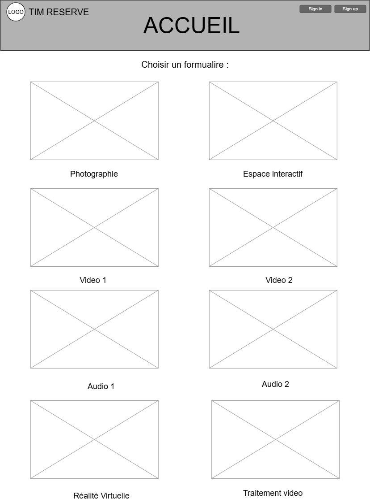

# TIM RESERVE

Projet conçu en équipe avec : Lukas, Felipe, Omar

## Le problème

- Problème : - Long processus (trop d'étapes)
             - Manque de guide (Not straightforward) 
             - Manque d'images
             - 
- Persona : -étudiant 
            -TTP 
            -Enseignant 

## La solution

- Proposition de valeur : Formulaire par cours, processus étape par étape guidé.
- Fonctionnalités du MVP :
    - En tant que étudiant, je veux louer du matériel afin d'utiliser du matériel 
    - En tant que TTP, je veux voir les demandes de réservations afin d'organiser le matériel. 
## L'expérience

- Direction artistique : couleurs #Rouge, #Noir, et police impact arial
- Sur téléphone et sur ordinateur : ...

## Le plan de développement

- Technologies et hébergement : ...
- Équipe : ...
- Échéancier : ...
- Budget : ... $
- Mesures du succès : ...

## La demande

Nous demandons ... $ pour ...

